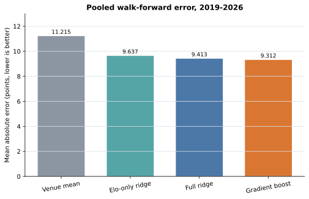
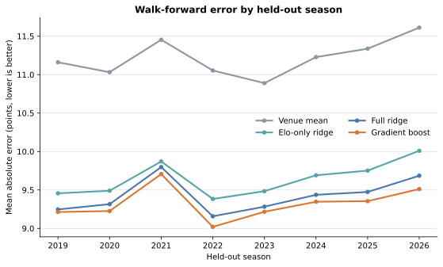

# College Basketball Model Validation

A real-data case study in point-in-time features, walk-forward evaluation, and date-clustered uncertainty for NCAA men's basketball margins.

This repository asks a deliberately narrow question: do simple pregame team-state features improve held-out margin forecasts, and does a nonlinear model add anything beyond a regularized linear model? The answer is evaluated chronologically, season by season, with every feature computed before the game result that updates it.

The study uses public SportsDataverse/hoopR schedule data. It contains no bookmaker data, private research inputs, market-selection rules, execution logic, or claim of a tradable edge.

## Study design

| Choice | Frozen specification |
| --- | --- |
| Outcome | Final home score minus final away score |
| Population | Final games with valid scores and active home/away teams; known non-Division-I opponents and administrative forfeits excluded |
| Source seasons | 2015–2026 |
| Held-out seasons | 2019–2026, one expanding-season fold at a time |
| State timing | Features emitted before the current result updates either team |
| Baseline | Training-only mean margin, split by neutral-site status |
| Interpretable models | Elo-only ridge and full-feature ridge |
| Nonlinear model | Frozen histogram gradient boosting specification |
| Primary metric | Mean absolute error in points |
| Secondary metrics | Root mean squared error and signed bias |
| Uncertainty | Paired 5,000-draw bootstrap over game-date clusters, stratified within season |

The feature constants and model hyperparameters were fixed before inspecting the final corrected result. No post-result window search or hyperparameter sweep is included.

## Results

The held-out evaluation contains 43,326 games across eight test seasons.

| Model | MAE | RMSE | Bias |
| --- | ---: | ---: | ---: |
| Venue mean | 11.215 | 14.376 | 0.084 |
| Elo-only ridge | 9.637 | 12.273 | 0.221 |
| Full ridge | 9.413 | 11.977 | 0.216 |
| Gradient boost | **9.312** | **11.831** | 0.230 |



The main complexity check is deliberately modest. Gradient boosting improves MAE over full ridge by 0.101 points, with a 95% paired date-clustered interval of [0.076, 0.126]. It is better in all eight held-out seasons. Full ridge improves on Elo-only ridge by 0.224 points [0.196, 0.253], and all feature-bearing models beat the venue baseline in every fold.



The result supports the point-in-time features and a small incremental role for nonlinearity. It does not support a large practical claim. The difficult 2021 fold has gradient-boost MAE of 9.707 and signed bias of 1.435 points, showing that a favorable pooled result does not remove season-specific drift.

## Reproduce the checked-in analysis

Requirements: Python 3.12 and [uv](https://docs.astral.sh/uv/).

```bash
uv sync --all-groups --frozen
uv run ncaab-validate verify-data
uv run ncaab-validate analyze --output build/reproduction
```

To rebuild the normalized data from the pinned public release assets:

```bash
uv run ncaab-validate fetch-data --raw-dir external/raw
uv run ncaab-validate reproduce --raw-dir external/raw
```

The source manifest records every asset URL, byte count, and SHA-256 digest. Rebuilding fails if a downloaded asset does not match the published snapshot.
The fetch command is resumable: an existing asset is reused only when its hash matches the manifest.

## Inspect the work

| Path | Purpose |
| --- | --- |
| [`data/source-manifest.json`](data/source-manifest.json) | Source URLs, hashes, filtering counts, and normalized dataset hash |
| [`src/ncaab_model_validation/features.py`](src/ncaab_model_validation/features.py) | Pregame state construction and post-emission updates |
| [`src/ncaab_model_validation/models.py`](src/ncaab_model_validation/models.py) | Frozen model specifications |
| [`src/ncaab_model_validation/evaluation.py`](src/ncaab_model_validation/evaluation.py) | Expanding-season folds and clustered comparison intervals |
| [`results/fold-metrics.csv`](results/fold-metrics.csv) | Held-out error for every season and model |
| [`results/mae-comparisons.csv`](results/mae-comparisons.csv) | Paired MAE improvements with clustered intervals |
| [`results/reproduction-manifest.json`](results/reproduction-manifest.json) | Hashes for every generated analysis artifact |
| [`tests/`](tests/) | Leakage, ordering, provenance, and inference checks |

## Interpretation boundary

This is a retrospective model-validation example, not a betting system. Lower error on historical final scores does not establish calibration against market prices, profitability after costs, stability under data revision, or future performance. The useful evidence here is methodological: source provenance is pinned, the feature clock is explicit, every test fold is later than its training data, uncertainty respects daily dependence, and a more complex model must earn its place against simpler references.

See the [research protocol](docs/research-protocol.md), [data provenance note](docs/data-provenance.md), and [disclosure boundary](docs/disclosure-boundary.md) for the full review surface.

## Contact

**Pete VanBenthuysen**

- Independent Quantitative Researcher, Sports Prediction Markets
- [pete@quadmresearch.com](mailto:pete@quadmresearch.com)
- [GitHub](https://github.com/PeteVanBenthuysen) · [QuadM Research](https://github.com/quadm-research)

## Licenses

The code is MIT licensed. See [`LICENSE`](LICENSE).

The checked-in normalized data is a modified subset of SportsDataverse/hoopR data and is distributed under CC BY 4.0. See [`DATA_LICENSE.md`](DATA_LICENSE.md) for attribution and change notices.
